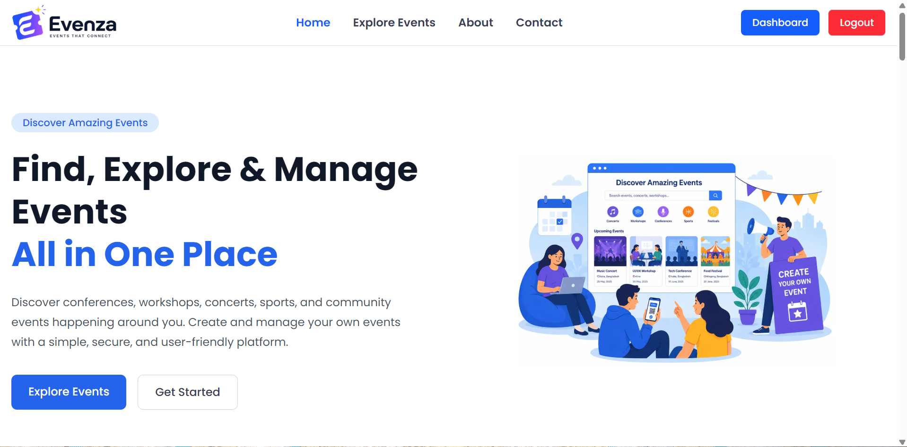
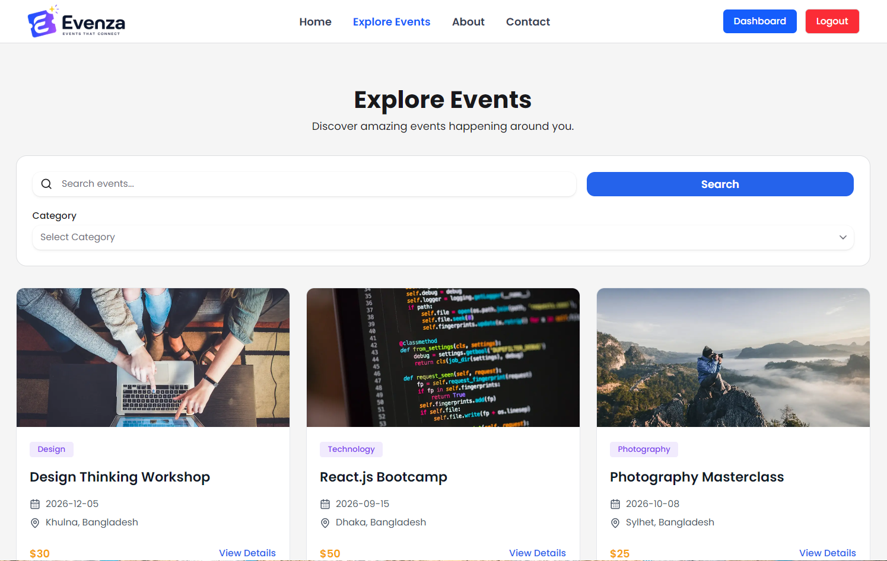
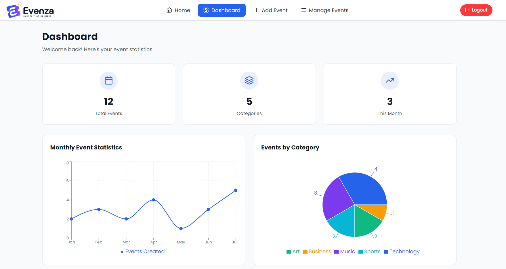
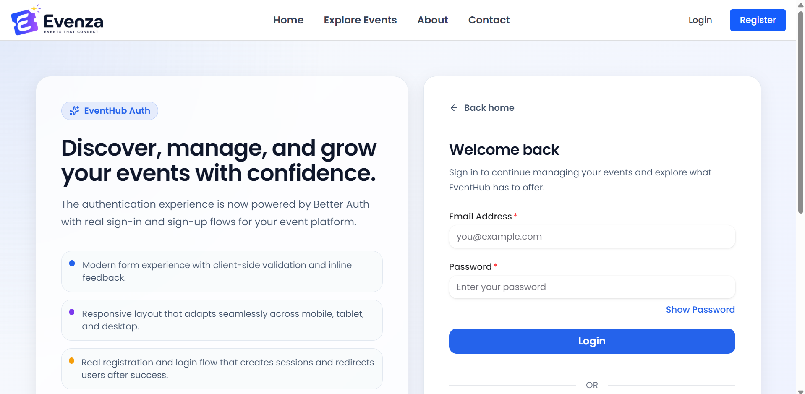

# 🎉 Evenza

A modern Event Discovery & Management Platform built with **Next.js**, **TypeScript**, **Express.js**, and **MongoDB**. Evenza allows users to discover events, publish their own events, and manage them through a secure dashboard.


---

## 🚀 Live Demo

### Frontend

https://evenza-client.vercel.app

---






# 📖 Project Overview

Evenza is a full-stack web application where users can:

- Discover upcoming events
- Search and filter events
- View event details
- Register & Login securely
- Publish events
- Manage their own events
- Delete published events
- View dashboard statistics

---

# ✨ Features

## Public Features

- Responsive Homepage
- Explore Events
- Event Details
- About Page
- Contact Page
- User Registration
- User Login
- Google Authentication

---

## User Dashboard

- Dashboard Overview
- Add New Event
- Manage Own Events
- Delete Events
- Logout

---

## Authentication

- Email & Password Login
- Google Login
- JWT Authentication
- Protected Routes

---

## Event Management

- Create Event
- View Own Events
- Delete Event
- Event Categories
- Ticket Price
- Venue & Location

---

## Dashboard

- Total Events
- Events by Category
- Monthly Statistics
- Responsive Cards

---

# 🛠 Tech Stack

## Frontend

- Next.js
- TypeScript
- Tailwind CSS
- HeroUI v3
- React Hot Toast
- React Icons
- Lucide React
- Recharts

---

## Backend

- Node.js
- Express.js
- TypeScript
- MongoDB
- Better Auth
- JWT

---

# 📂 Project Structure

```text
src
│
├── app
│
├── components
│   ├── home
│   ├── dashboard
│   ├── ui
│   └── shared
│
├── hooks
│
├── lib
│
├── services
│
├── types
│
└── utils
```

---

# 📸 Pages

- Home
- Explore Events
- Event Details
- About
- Contact
- Login
- Register

### Dashboard

- Dashboard Overview
- Add Event
- Manage Events

---

# 📱 Responsive Design

- Mobile
- Tablet
- Desktop

---

# 🔮 Future Improvements

- Edit Event
- Event Booking
- Wishlist
- Email Notifications
- Image Upload
- Admin Dashboard
- Dark Mode

---

# 👨‍💻 Author

**Atik Hasan Sarker**

Department of Information Science and Library Management

Noakhali Science and Technology University

GitHub:
https://github.com/your-github

LinkedIn:
https://linkedin.com/in/your-linkedin

---

# 📄 License

This project is licensed under the MIT License.